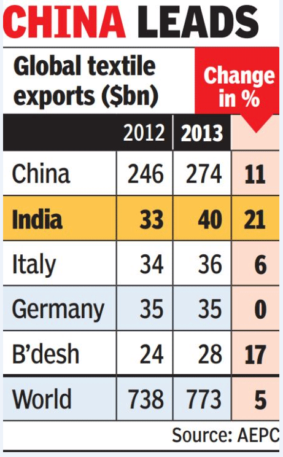

```{r}
library(tidyverse)
library(tradestatistics)
```

The data are provided by the [Open Trade Statistics project]https://tradestatistics.io/ using an API (application programmer interface). 
This allows computer programs to access the data selectively.

```{r}
 ots_tables
```


# Download dataset

```{r message = F, warning = F}
fullrun <- 0
# Harmonised System product codes (used by customs)

# 1279	57	Alias for all codes in the group Carpets and other textile floor coverings
# 1280	58	Alias for all codes in the group Fabrics; special woven fabrics, tufted textile fabrics, lace, tapestries, trimmings, embroidery
# 1281	59	Alias for all codes in the group Textile fabrics; impregnated, coated, covered or laminated; textile articles of a kind suitable for industrial use
# 1282	60	Alias for all codes in the group Fabrics; knitted or crocheted

# 1283	61	Alias for all codes in the group Apparel and clothing accessories; knitted or crocheted
# 1284	62	Alias for all codes in the group Apparel and clothing accessories; not knitted or crocheted

# 1285	63	Alias for all codes in the group Textiles, made up articles; sets; worn clothing and worn textile articles; rags

textiles <- c("57", "58", "59", "60", "61", "62", "63")
clothing <- c("61", "62")


if(fullrun){
  df <- ots_create_tidy_data(years = c(1962:2018), 
                              reporters = "all", 
                              partners = "all",
                              products = clothing, 
                              table = "yrpc") # Product trade at detailed level (Year, reporter, and Product Code)
  saveRDS(df, file = "clothing_exports.rds")
} else { df <- readRDS(file = "clothing_exports.rds")
  
}
```

# Viz By product group

```{r}
agg_df <- df %>% group_by(year, section_code, group_code, product_shortname_english) %>% 
  summarise(tot_exp = sum(export_value_usd, na.rm = TRUE)/1e9)

ggplot(agg_df, aes(x = year, y = tot_exp, 
                   col = product_shortname_english, group = product_shortname_english)) + 
  geom_line() +
  facet_wrap(. ~ group_code, ncol = 1)
```


# By country

According to [wikipedia](https://en.wikipedia.org/wiki/Clothing_industry#Production):

>In 2016, the largest apparel exporting nations were China ($161 billion), Bangladesh ($28 billion), Vietnam ($25 billion), India ($18 billion), Hong Kong ($16 billion), Turkey ($15 >billion) and Indonesia ($7 billion). 

Let us verify this statement.

```{r}
agg_df <- df %>% filter(group_code %in% c("61", "62")) %>%
  group_by(year, reporter_iso, reporter_fullname_english) %>% 
  summarise(tot_exp = sum(export_value_usd, na.rm = TRUE)/1e9)

top <- df %>% filter(year == 2016) %>% group_by(reporter_fullname_english) %>%
  summarise(tot_exp = sum(export_value_usd, na.rm = TRUE)/1e9) %>% 
  top_n(n = 12)

top_countries <- top$reporter_fullname_english

ggplot(subset(agg_df, reporter_fullname_english %in% top_countries), aes(x = year, y = tot_exp)) + 
  geom_line() +
  facet_wrap(~reporter_fullname_english, scales = "free_y")

```

We can see that Germany, Italy, Spain, France and Turkey are large clothing exporters as well.
Turns out that European countries are missing from this statement.

Checking the original source, we find that the EU was mentioned, but not the individual countries.

An additional check is this source from India (with a broader definition of Textiles):



# Prepare aggregated set for the course

```{r}
df2 <- df %>% group_by(year, reporter_iso, reporter_fullname_english, partner_iso, partner_fullname_english) %>%
  summarise(export_value_usd = sum(export_value_usd, na.rm = TRUE)/1e9, import_value_usd = sum(import_value_usd, na.rm = TRUE)/1e9)

saveRDS(df2, "clothing_exports_aggregated.rds")
```


